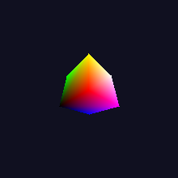
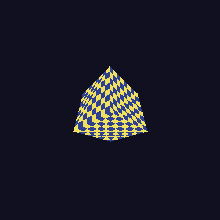

# Sirion, a programmable GPU in SystemVerilog

Sirion is a from-scratch, educational-but-architecturally-real GPU: a custom
SIMT ISA, a golden C++ instruction-set simulator, a Python assembler, a C-like
kernel compiler, and cycle-accurate SystemVerilog RTL that runs the same
binaries, verified bit-exact against the ISS at every step, pixel-exact for
graphics. No vendor IP. Inspired by modern SIMT designs (NVIDIA SM, AMD CU,
academic cores like Vortex/MIAOW) but copying none of them.

It was built compute-first: get one SIMT compute unit running real kernels
against the golden simulator, then grow outward: memory hierarchy, multiple
CUs, floating point, atomics, and finally a programmable graphics pipeline
whose vertex and fragment shaders run as kernels *on the same compute units*.

These frames were rendered by the RTL, cycle by cycle, under Verilator:

| Gouraud-shaded cube (M9) | textured cube (M10) | hardware-sequenced frame (M20) |
|---|---|---|
|  |  |  |

The third one is worth a note: `gfx_seq` (M20) runs an entire draw call in
hardware with zero host involvement, and its output frame is byte-identical
to M19's host-orchestrated version of the same scene. That's not a rendering
bug, it's the actual test: hardware sequencing is only correct if it
reproduces the software-driven pipeline exactly, and it does.

## Contents

- [What's in the machine](#whats-in-the-machine)
- [Quick start](#quick-start)
- [Measured performance](#measured-performance-rtl-under-verilator-from-the-self-checking-suite)
- [How it was built](#how-it-was-built)
- [Repository layout](#repository-layout)
- [Deferred](#deferred-documented-not-built)
- [AI Use and Tooling](#ai-use-and-tooling)

## What's in the machine

- **ISA + toolchain**: fixed 32-bit, fully predicated SIMT ISA (16 vector regs,
  4 predicates, IPDOM reconvergence with `SSY` markers); `scripts/asm.py`
  assembles to `.gpubin`; `scripts/sirc.py` compiles a C-like language (floats,
  `__shared__`, `barrier()`, atomics, SFU intrinsics, inlined functions,
  register spilling) down to that assembly. One encoding, defined once per
  language (`sim/iss/isa.hpp` ↔ `rtl/sirion_pkg.sv`), cross-checked by test.
- **The compute unit** (`rtl/compute/cu_core.sv`): 8 resident warps of 32 lanes
  on a 4-stage **barrel pipeline** (PICK/FETCH/READ/EXEC + a parallel
  lane-walking memory unit). One instruction per warp in flight means no
  intra-warp hazards by construction. Hardware reconvergence stack, predication,
  cross-warp barrier, shared memory, FP + SFU in every lane.
- **Memory**: per-lane accesses coalesced into line transactions, line-granular
  write-through L1s, a shared write-back **L2 that is the coherence point**
  (atomics execute there), hardware block/grid dispatch across multiple CUs.
- **Graphics**: rasterizer with perspective-correct interpolation, bilinear +
  mipmap filtering, alpha blending, and an on-chip command sequencer
  (`gfx_seq`) that runs an entire draw call (VS grid → raster → fragment DMA →
  FS grid → ROP) with zero host involvement.
- **Verification**: the ISS is the single golden reference. RTL unit tests call
  the *same* C++ reference functions the ISS executes; integration tests diff
  final memory/registers bit-for-bit; graphics tests diff frames pixel-exact.
  SVA assertions compiled in, waveforms on. The full suite (79 tests) is green
  on both MSYS2 (Verilator 5.040) and WSL Ubuntu (5.020).

## Quick start

```bash
bash run_all.sh   # everything: ISS tests + compiler tests + RTL tests
make test         # golden-ISS self-checking tests
make hl           # compile high-level kernels -> .gpubin and run them
make sim          # Verilate + run all RTL tests (SVA + waveforms)
make lint         # Verilator lint
make runner       # CLI kernel runner on the ISS
make runner-rtl   # CLI kernel runner on the REAL RTL GPU
make png          # convert build/*.ppm renders to PNG
make wavetext     # view the newest waveform as a terminal table
```

Want to write programs for it? **`docs/PROGRAMMING.md`** is the hands-on guide:
write a kernel in the C-like language or assembly, compile it, and run it on
the ISS or the RTL from the command line.

Host setup quirks (MSYS2 PATH trap, Verilator version differences, PPM viewer
weirdness) are collected in **`docs/BUILDING.md`**.

## Measured performance (RTL under Verilator, from the self-checking suite)

| Metric | Result |
|--------|--------|
| Issue rate (compute-bound, 8 warps) | IPC 0.756, ~3.8× the earlier multicycle core |
| Coalescing (aligned 32-lane load) | exactly 4 line transactions (32 lanes / 8-word lines) |
| L1 hit rate (per-lane sequential reuse kernel) | 87% |
| Multi-CU scaling (16 compute-heavy blocks, 4 CUs) | ≥ 2.93× vs serial |
| Atomic histogram (2000 threads, 16 bins, 4 CUs) | exact counts, serialized at the L2 |
| Full hardware frame (96×96, 2 draws + compute texture-gen) | ~65K cycles end to end |

## How it was built

Milestone by milestone, each one tested and documented before the next:
toolchain proof → ISA + ISS + assembler → datapath blocks → single-warp core →
SIMT reconvergence → memory → shared memory + barrier → compiler → caches +
scheduler → FP → rasterizer → textures → multi-warp → hardware dispatch →
barrel pipeline → coalescer + L1 → FP datapath → atomics + SFU → multi-CU + L2
→ advanced graphics → programmable shaders → hardware-sequenced pipeline →
compiler completeness → FPGA synthesis-readiness (sv2v + yosys elaborate the
full GPU; `docs/FPGA.md`).

**`docs/WALKTHROUGH.md`** is the detailed build log, including the real bugs
each stage's tests caught (a store-data mux that only handled global stores, a
sin LUT that wrapped at 90°, an L2 ack race that exactly doubled atomic
counts, a spill kernel that silently wrapped instruction memory...). The
bug-hunt stories are honestly the best part.

## Repository layout

```
rtl/       sirion_pkg.sv (first)  common/  compute/  scheduler/  cache/  graphics/
           gpu_top.sv (compute device)  gpu_gfx_top.sv (full GPU + gfx sequencer)
sim/       iss/ (golden simulator)  hostapi/  gfx/ (golden renderer)
           tests/  rtl_driver.hpp  run_{iss,hl,rtl}_tests.sh
scripts/   asm.py  sirc.py (compiler)  ppm_tool.py  vcd2txt.py
tests/     kernels/*.s (assembly test kernels)
tools/     sirion_run.cpp (CLI runner, ISS + RTL backends)
examples/  render_scene.cpp (host-API demo)
synth/     synth.sh (sv2v + yosys flow)
docs/      ISA.md  PROGRAMMING.md  WALKTHROUGH.md  datapath.md  FPGA.md  BUILDING.md
```

## Deferred (documented, not built)

MMU/TLB virtual addressing, geometry/tessellation stages, a non-inlined
CALL/RET ABI, GTO warp scheduling, texture compression, trilinear filtering.
And it's simulation-first: the synthesis flow proves the design elaborates and
the CU synthesizes, but no bitstream has touched a physical board yet.

## AI Use and Tooling

Up front: I used AI (Claude Code) throughout this project, for the code and
for essentially all of these docs, this section included. This is the
biggest of my four projects and it shows in the volume of documentation. I
wrote the spec and milestone plan, drove the build, and did the hardware
debugging myself. The build toolchain and a real hardware race it caught are
in [TOOLING.md](TOOLING.md).
